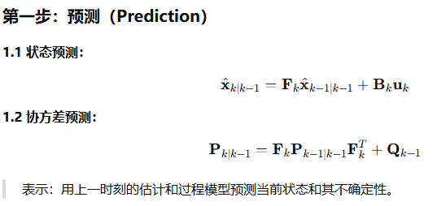
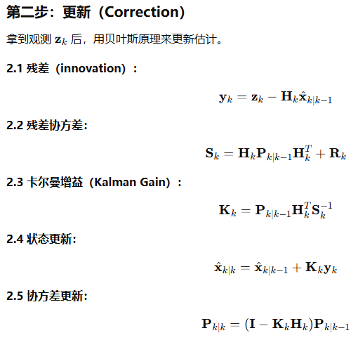

# 卡尔曼滤波算法

本仓库用于对之前学的`KalmanFilter`进行整理，方便以后复习。

**卡尔曼滤波算法主要有两个用途：**

#### 1、数据滤波（去噪）

**GPS 或 IMU 数据滤波**：GPS 信号不稳定，使用卡尔曼滤波可以平滑位置数据。

**鼠标轨迹平滑**：用户移动鼠标会有抖动，卡尔曼滤波能输出更稳定的轨迹。

**电流、电压传感器数据滤波**：使读数更接近实际值。

#### 2、状态估计（含预测）

**目标跟踪（tracking）**：通过雷达、相机等输入，仅观测位置，卡尔曼滤波可以同时估计目标的位置 + 速度，即**多传感器融合**。

**机器人定位与控制**：机器人不可能实时精确知道自身状态（例如位置、速度），用卡尔曼滤波对运动过程建模与估计。

## 代码介绍：

**项目中先对cam和radar数据分别进行滤波，随后对滤波后的数据进行融合，最后对融合数据再次进行滤波；**

```
# cam和radar数据融合
KalmanFusion.h    
KalmanFusion.cpp   

# 数据滤波
KalmanFilter.cpp
KalmanFilter.h

# 文件传输数据
WriteFile.cpp
WriteFile.h

# 测试函数
main.cpp

# 用于绘图
test.py
```


## 推导过程

卡尔曼滤波包括两个步骤：





#### **1. 状态预测**

- **定义**：基于系统动力学模型，从上一时刻的状态估计值 *x*^*k*−1∣*k*−1 推算当前时刻的状态预测值 *x*^*k*∣*k*−1。
- **物理意义**：对系统真实状态（如位置、速度、温度等）的预测，回答 “系统可能处于什么状态？”。

#### **2. 协方差预测**

- **定义**：预测状态估计误差的协方差矩阵 $P_{k∣k−1}$，反映状态预测的不确定性。
- **物理意义**：量化状态预测的可信程度，回答 “预测的状态有多准确？”。

#### 卡尔曼增益

**卡尔曼增益（Kalman Gain）** 是连接预测与观测的核心参数，其本质是对 “预测值” 和 “观测值” 的权重分配；

卡尔曼增益可看作一个 “加权系数”，其取值范围隐含了对预测与观测的信任程度：

- $K_k→0$：更信任预测值，观测影响小；
- $K_k→H_{k−1}$（理想情况）：更信任观测值，预测影响小。

## 调参

 **🔧 1. 先调 R，再调 Q**

- **R** 比较容易估计，因为你知道传感器噪声范围。
- **Q** 很难准确建模，很多时候是通过实验不断调出来的。

 **🔁 2. R 大，Q 小 → 更信预测，滤波更平滑**

- 系统**更相信自己的模型**，测量误差被认为大，滤波后响应更慢但更稳。

 **🔁 3. R 小，Q 大 → 更信观测，响应快但抖动大**

- 系统**更相信传感器**，但受噪声影响大，可能不稳定。